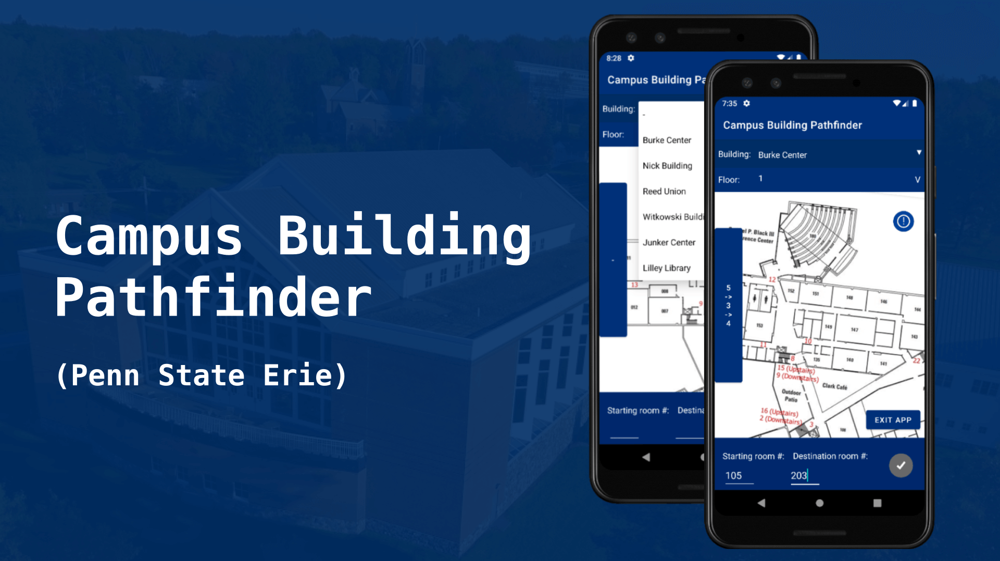
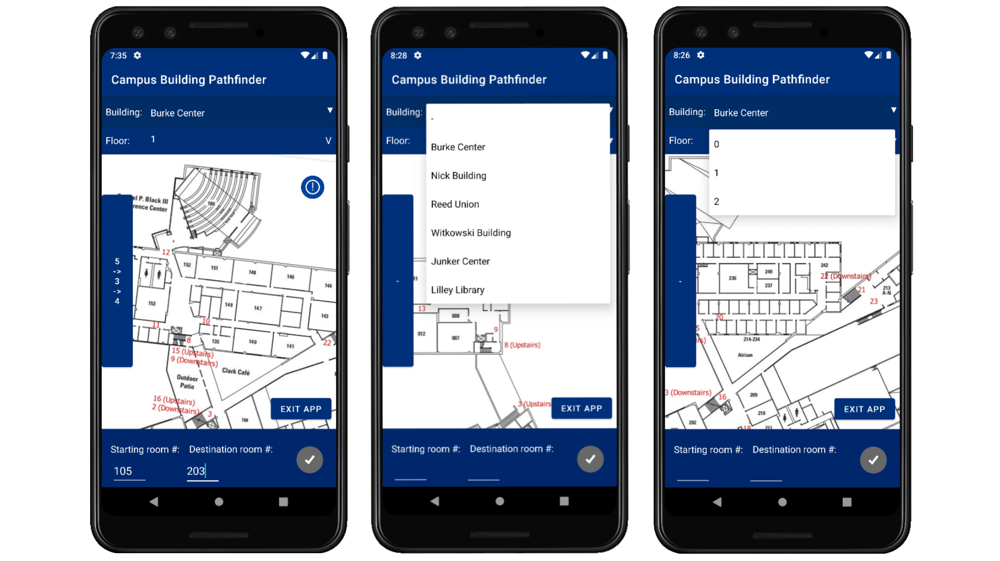

# Campus Building Pathfinder (Penn State Behrend)

## Proposal
Due to the complexity of floors at Penn State Behrend campus buildings, despite the installation of floor plans and guides, navigation can still be a challenge to both new and veteran students and staffs, and has caused many problems, such as arriving late for appointments or classes, unable to locate facilities, etc. Our primary proposal is to make navigation inside campus buildings easier for everyone using modern technologies.

## Proposal Objective
The objective of Campus Building Pathfinder(CBP) is to design and create an interactive, mobile, and accessible floor plan that the user can use while walking through floors. This objective is achievable by creating a mobile app. Users should be able to select the current building and floor at any time. CBP should also be able to rotate floor plans using smartphones’ gyroscope technology, so that users can be sure that they are walking in the right direction. CBP will be developed for Android. CBP should be usable without the need to connect to the internet, everything runs locally on users’ phones. To make CBP accessible to people with older model phones, CBP should still be able to run in the absence of a gyroscope (With floor plan rotation disabled). 

## Software Application
Provide interactive floor plans to help students, staffs, and visitors navigate inside campus buildings easily and quickly, reduce inconveniences by saving time and minimize confusion.

## Install Instruction
1. Download the latest apk from [here](https://github.com/JiayuanWen/Campus-Building-Pathfinder-Penn-State-Behrend/releases)
2. Upload the apk to your Android device
4. Go to your device's settings and allow install apps from unknown sources
5. Find the apk in your device, run it to start the installation
